# hypercoplexAI — HDIM: Hypercomplex Domain Isomorphism Machine

[Python 3.10+](https://www.python.org/downloads/)
[PyTorch](https://pytorch.org/)
[License: MIT](LICENSE)
[Status: Research]()

> **Best score: 1.1370** (Phase 8e, ep45) — `pair_margin=0.906`, `STS=0.770`
> **Current:** Phase 19 running (ep11, score=0.489) | Phase 20 prepared (DCL + Uniformity)

---

## 📚 Документация


| Документ                                         | Описание                                                            |
| ------------------------------------------------ | ------------------------------------------------------------------- |
| **[docs/ARCHITECTURE.md](docs/ARCHITECTURE.md)** | Полное описание архитектуры: слои, компоненты, API, конфигурации    |
| **[docs/DIAGRAMS.md](docs/DIAGRAMS.md)**         | Mermaid-диаграммы: потоки данных, sequence diagrams, class diagrams |
| **[HDIM.md](HDIM.md)**                           | Техническая спецификация: формулы, алгоритмы, фазы развития         |
| **[.omc/research/](.omc/research/)**             | Исследовательские отчёты: core, models, training, синтез            |


---

## Overview

**HDIM** (Hypercomplex Domain Isomorphism Machine) is a research system for
**cross-domain structural analogy search** via hypercomplex invariants.

Unlike LLMs that compare texts by token proximity, HDIM finds **structural isomorphisms**
between problems from entirely different domains with different vocabularies but the same
deep structure.

**Canonical example:** Cavitation erosion (engineering) vs dental plaque removal (dentistry).
Different words, identical physics. Standard embedding models miss this; HDIM finds it via
a domain-invariant hypercomplex representation that strips domain vocabulary and preserves
structural topology.

---

## 🏗️ Architecture Overview

```
┌─────────────────────────────────────────────────────────────────────────┐
│                         HYPERCOREPLEX AI (HDIM)                         │
├─────────────────────────────────────────────────────────────────────────┤
│  Scripts Layer                                                          │
│  ┌─────────────────┐  ┌─────────────────┐  ┌─────────────────┐          │
│  │  gpu_train.py   │  │    train.py     │  │   hdim_demo.py  │          │
│  └────────┬────────┘  └────────┬────────┘  └────────┬────────┘          │
├───────────┼────────────────────┼────────────────────┼───────────────────┤
│  Training Layer                                                         │
│  ┌────────┴────────┐  ┌────────┴────────┐   ┌───────┴────────┐          │
│  │  HDIMTrainer    │  │ ExperimentRun   │   │   Datasets     │          │
│  └────────┬────────┘  └─────────────────┘   └────────────────┘          │
├───────────┼─────────────────────────────────────────────────────────────┤
│  Model Layer                                                            │
│  ┌────────┴────────┐  ┌─────────────────┐  ┌─────────────────┐          │
│  │  HDIMModel      │  │ TextHDIMModel   │  │ SBERTEncoder    │          │
│  └────────┬────────┘  └─────────────────┘  └─────────────────┘          │
├───────────┼─────────────────────────────────────────────────────────────┤
│  Core Layer                                                             │
│  ┌────────┴────────┬─────────────────┬─────────────────┐                │
│  │ CliffordAlgebra │ InvariantExtr.  │ TitansMemory    │                │
│  └─────────────────┴─────────────────┴─────────────────┘                │
│  ┌────────┴────────┬─────────────────┐                                  │
│  │ SoftMoERouter   │  HDIMPipeline   │                                  │
│  └─────────────────┴─────────────────┘                                  │
└─────────────────────────────────────────────────────────────────────────┘
```

**📊 См. [docs/DIAGRAMS.md](docs/DIAGRAMS.md) для детальных mermaid-диаграмм.**

---

## Key Features

- **Clifford Algebra Cl(3,1,0)** — degenerate algebra, `clifford_dim=16` multivectors,
Cayley-table geometric product (precomputed, no runtime overhead)
- **Structural Invariant Extraction** — `[U_inv = R⁻¹ ⊗ G_A ⊗ R](src/core/domain_operators.py:54)` (sandwich product)
strips domain signature, exposing pure structural topology
- **Domain Transfer** — `[G_B = R_B ⊗ U_inv ⊗ R_B⁻¹](src/core/domain_operators.py:103)` reconstructs target-domain
multivector from invariant
- **Titans Memory (TTT)** — `[TitansMemoryModule](src/core/titans_memory.py:30)` with fp32-safe AMP path
- **Soft MoE Routing** — `[SoftMoERouter](src/core/soft_moe_router.py:43)`, Puigcerver et al. ICLR 2024
- **Focal-InfoNCE** — Phase 17 fix: gamma applied only to denominator
- **DCL + Uniformity+Alignment** — Phase 20 additions
- **Frozen SBERT + trainable MLP** — `[paraphrase-multilingual-mpnet-base-v2](src/models/sbert_encoder.py:20)`

---

## 📦 Project Structure

```
hypercoplexAI/
├── src/
│   ├── core/
│   │   ├── hypercomplex.py       # CliffordAlgebra, QuaternionLinear
│   │   ├── domain_operators.py   # DomainRotor, InvariantExtractor
│   │   ├── hdim_pipeline.py      # HDIMPipeline orchestrator
│   │   ├── titans_memory.py      # TitansMemoryModule (TTT)
│   │   └── soft_moe_router.py    # SoftMoERouter (DEFAULT)
│   ├── models/
│   │   ├── hdim_model.py         # HDIMModel, HDIMConfig
│   │   ├── text_hdim_model.py    # TextHDIMModel
│   │   ├── sbert_encoder.py      # SBERTEncoder wrapper
│   │   └── model_factory.py      # build_*() functions
│   └── training/
│       ├── trainer.py            # HDIMTrainer (all losses)
│       ├── dataset.py            # DomainProblemDataset
│       └── real_dataset.py       # RealPairsDataset
├── scripts/
│   ├── gpu_train.py              # PRIMARY training script
│   └── auto_tune.py              # Hyperparameter search
├── docs/
│   ├── ARCHITECTURE.md           # Full architecture docs
│   └── DIAGRAMS.md               # Mermaid diagrams
├── .omc/research/
│   ├── core-architecture.md      # Core layer analysis
│   ├── model-stack.md            # Model layer analysis
│   ├── training-and-ops.md       # Training layer analysis
│   └── architecture-synthesis.md # Unified architecture map
├── hdim_demo.py                  # Component demo
├── HDIM.md                       # Technical specification
└── README.md                     # This file
```

---

## 🚀 Quick Start

### Prerequisites

```bash
pip install torch>=2.0 sentence-transformers>=2.2 numpy scipy
```

### Installation

```bash
git clone https://github.com/your-org/hypercoplexAI.git
cd hypercoplexAI
pip install -r requirements.txt
```

### Minimal Example

```python
from src.models.model_factory import build_sbert_hdim_model
from src.models.hdim_model import HDIMConfig

# Create model
config = HDIMConfig(
    hidden_dim=256,
    num_domains=4,
    num_experts=4,
    top_k=2,
    memory_key_dim=32,
)
model = build_sbert_hdim_model(
    config,
    soft_router=True,      # Recommended
    freeze_sbert=True,     # Recommended
    z_loss_weight=0.01,     # MoE anti-collapse
)

# Encode texts
texts = ["example problem description", "another problem"]
encodings = model.encode_texts(texts, device="cuda")

# Cross-domain transfer
import torch
target_domain = torch.tensor([1, 1], device="cuda")
output, routing, invariant, state = model.transfer_text_pairs(
    texts, domain_id, target_domain
)
```

### Training

```bash
# GPU training (PRIMARY mode)
python scripts/gpu_train.py \
    --use_pairs \
    --amp \
    --hidden_dim 256 \
    --num_experts 4 \
    --lambda_z 0.01 \
    --infonce_temperature 0.15 \
    --epochs 60
```

---

## 📊 Architecture at a Glance

### Core Pipeline Transfer Flow

```mermaid
flowchart LR
    X["Input<br/>B×hidden_dim"] --> E["HDIMEncoder"] --> G["g_source<br/>B×clifford_dim"]
    G --> I["InvariantExtractor<br/>R⁻¹⊗G⊗R"] --> U["u_inv"]
    U --> N["LayerNorm"] --> M["TitansMemory<br/>TTT"]
    M --> MOE["SoftMoERouter<br/>4 experts"] --> R["u_route"]
    R --> T["sandwich_transfer<br/>R_target⊗u⊗R_target⁻¹"]
    T --> D["HDIMDecoder"] --> OUT["Output<br/>B×output_dim"]
```




### Mathematical Contract


| Operation         | Formula                         | Code Reference                                          |
| ----------------- | ------------------------------- | ------------------------------------------------------- |
| Encode A          | `G_A = MLP(SBERT(text_A))`      | `[HDIMEncoder](src/core/hdim_pipeline.py:90)`           |
| Extract invariant | `U = R⁻¹ ⊗ G_A ⊗ R`             | `[InvariantExtractor](src/core/domain_operators.py:54)` |
| Transfer to B     | `G_B = R_B ⊗ U ⊗ R_B⁻¹`         | `[sandwich_transfer](src/core/domain_operators.py:103)` |
| Isomorphism loss  | `L_iso = MSE(G_B, G_B_target)`  | `[HDIMTrainer](src/training/trainer.py:167)`            |
| PRIMARY score     | `pair_margin × 1.0 + STS × 0.3` | `[compute_primary_score](scripts/gpu_train.py:58)`      |


---

## 🔧 Configuration

### HDIMConfig

```python
from src.models.hdim_model import HDIMConfig

config = HDIMConfig(
    hidden_dim=256,          # Input/output dimension
    num_domains=4,           # Number of domain rotors
    num_experts=4,           # MoE expert count
    top_k=2,                 # Active experts per token
    memory_key_dim=32,       # Titans key dimension
    clifford_p=3,            # Cl_{p,q,r} positive bases
    clifford_q=1,            # Negative bases
    clifford_r=0,            # Nilpotent bases
    domain_names=["physics", "chemistry", "biology", "engineering"],
)
```

**📋 См. [docs/ARCHITECTURE.md#9-конфигурации](docs/ARCHITECTURE.md#9-конфигурации) для полного списка параметров.**

---

## 📈 Training

### Loss Suite


| Loss              | Weight | Phase | Description             |
| ----------------- | ------ | ----- | ----------------------- |
| `loss_recon`      | 1.0    | 1     | Reconstruction MSE      |
| `loss_iso`        | 0.1    | 1     | Isomorphism MSE         |
| `loss_pair`       | 0.1    | 3     | InfoNCE / Focal-InfoNCE |
| `loss_routing`    | 0.05   | 7     | Routing entropy         |
| `router_z_loss`   | 0.01   | 9     | MoE anti-collapse       |
| `loss_memory`     | 0.05   | 6     | Titans memory MSE       |
| `loss_dcl`        | 0.2    | 20    | Decoupled Contrastive   |
| `loss_uniformity` | 0.1    | 20    | Uniformity+Alignment    |


**📊 См. [docs/ARCHITECTURE.md#5-training-layer](docs/ARCHITECTURE.md#5-training-layer) для детального описания losses.**

### PRIMARY Score

```
PRIMARY_SCORE = pair_margin × 1.0 + STS_exported × 0.3
```

**Best achieved:** 1.1370 (Phase 8e, ep45)

---

## ✅ Stable vs Experimental

### Production-Ready


| Component                | File                                                          | Status   |
| ------------------------ | ------------------------------------------------------------- | -------- |
| `CliffordAlgebra`        | `[hypercomplex.py:20](src/core/hypercomplex.py:20)`           | ✅ Stable |
| `DomainRotationOperator` | `[domain_operators.py:19](src/core/domain_operators.py:19)`   | ✅ Stable |
| `InvariantExtractor`     | `[domain_operators.py:54](src/core/domain_operators.py:54)`   | ✅ Stable |
| `TitansMemoryModule`     | `[titans_memory.py:30](src/core/titans_memory.py:30)`         | ✅ Stable |
| `SoftMoERouter`          | `[soft_moe_router.py:43](src/core/soft_moe_router.py:43)`     | ✅ Stable |
| `HDIMPipeline`           | `[hdim_pipeline.py:128](src/core/hdim_pipeline.py:128)`       | ✅ Stable |
| `HDIMModel`              | `[hdim_model.py:117](src/models/hdim_model.py:117)`           | ✅ Stable |
| `TextHDIMModel`          | `[text_hdim_model.py:191](src/models/text_hdim_model.py:191)` | ✅ Stable |
| `SBERTEncoder`           | `[sbert_encoder.py:20](src/models/sbert_encoder.py:20)`       | ✅ Stable |
| `HDIMTrainer`            | `[trainer.py:19](src/training/trainer.py:19)`                 | ✅ Stable |


### Experimental (Not for Production)


| Component                  | File                                                                      | Warning          |
| -------------------------- | ------------------------------------------------------------------------- | ---------------- |
| `HierarchicalTitansMemory` | `[hierarchical_memory.py:46](src/core/hierarchical_memory.py:46)`         | Experimental     |
| `ModularMoERouter`         | `[modular_moe.py:93](src/core/modular_moe.py:93)`                         | ⚠️ Do not use    |
| `AdvancedTextEncoder`      | `[advanced_text_encoder.py:244](src/models/advanced_text_encoder.py:244)` | Worse than SBERT |


---

## ⚠️ Known Issues

### Anti-Patterns (Do NOT)

- ❌ `ModularMoERouter` — use `SoftMoERouter`
- ❌ `reset_memory('zero')` — use `reset_memory('geometric')`
- ❌ `batch_size < 32` — InfoNCE requires sufficient negatives
- ❌ `temperature < 0.15` — causes overconfidence
- ❌ `lambda_z = 0` — causes MoE collapse within 10 epochs

### Phase 17 Critical Fixes (C1-C7)


| Code | Issue                       | Fix                             |
| ---- | --------------------------- | ------------------------------- |
| C1   | SoftMoERouter guard for T=1 | Added epsilon in softmax        |
| C2   | Dynamic load-balance loss   | EMA scores for stability        |
| C3   | Out-of-place operations     | In-place tensor ops             |
| C4   | fp32 TTT path               | TitansMemory in fp32 during AMP |
| C5   | Memory drift                | `reset_memory()` per epoch      |
| C6   | Focal gamma                 | Applied to denominator only     |
| C7   | Non-leaf tensor fix         | `.clone()` for non-leaf tensors |


---

## 🔗 Key References


| Resource              | Link                                                         |
| --------------------- | ------------------------------------------------------------ |
| **Architecture Docs** | [docs/ARCHITECTURE.md](docs/ARCHITECTURE.md)                 |
| **Diagrams**          | [docs/DIAGRAMS.md](docs/DIAGRAMS.md)                         |
| **Technical Spec**    | [HDIM.md](HDIM.md)                                           |
| **Research Reports**  | [.omc/research/](.omc/research/)                             |
| **Core Pipeline**     | `[src/core/hdim_pipeline.py](src/core/hdim_pipeline.py)`     |
| **Model Factory**     | `[src/models/model_factory.py](src/models/model_factory.py)` |
| **Trainer**           | `[src/training/trainer.py](src/training/trainer.py)`         |


---

## 📖 Citation

If you use HDIM in research, please cite:

```bibtex
@software{hdim2026,
  title  = {HDIM: Hypercomplex Domain Isomorphism Machine},
  year   = {2026},
  url    = {https://github.com/your-org/hypercoplexAI}
}
```

**Key references:**

- Puigcerver et al. (2024) — Soft MoE: *From Sparse to Soft Mixtures of Experts*
- Gu & Dao (2023) — Titans Memory (Test-Time Training)
- Yeh et al. (2022) — Decoupled Contrastive Learning (DCL)
- Wang & Isola (2020) — Understanding Contrastive Representation Learning

---

## 📄 License

MIT License — see [LICENSE](LICENSE) for details.

---

*Generated: 2026-03-13 | Research prototype — API may change between phases*