# HDIM Diagrams & Flow Charts

> **Дата:** 2026-04-09
> **Verification:** pytest 754 PASS (10 skipped) | Lean4 161/163 PASS
> **Формат:** Mermaid diagrams с clickable ссылками на код

---

## Оглавление

1. [Глобальная архитектура](#1-глобальная-архитектура)
2. [Core Pipeline Flow](#2-core-pipeline-flow)
3. [Training Loop Flow](#3-training-loop-flow)
4. [Model Factory Flow](#4-model-factory-flow)
5. [API Sequence Diagrams](#5-api-sequence-diagrams)
6. [Loss Computation Flow](#6-loss-computation-flow)
7. [Memory Flow (Titans)](#7-memory-flow-titans)
8. [Data Structures](#8-data-structures)
9. [Hallucination Detection & Feedback Flow](#9-hallucination-detection--feedback-flow)
10. [Online Learning Pipeline](#10-online-learning-pipeline)
11. [HBMAMemory Architecture](#11-hbmamemory-architecture)

---

## 1. Глобальная архитектура

### 1.1 Обзор подсистем

```mermaid
graph TB
    subgraph Scripts["Scripts Layer"]
        GPU["scripts/gpu_train.py<br/>AMP, GPU training"]
        CLI["src/training/train.py<br/>CLI entrypoint"]
        DEMO["hdim_demo.py<br/>Demos"]
    end

    subgraph Training["Training Layer"]
        TRAINER["HDIMTrainer<br/>Losses, regimes"]
        RUNNER["ExperimentRunner<br/>Orchestration"]
        DATA["Datasets<br/>DomainProblem, RealPairs"]
        CONFIG["ExperimentConfig<br/>Training params"]
    end

    subgraph Models["Model Layer"]
        FACTORY["model_factory<br/>build_*() functions"]
        HDIM["HDIMModel<br/>Core wrapper"]
        TEXT["TextHDIMModel<br/>Text wrapper"]
        SBERT["SBERTEncoder<br/>Frozen + projection"]
        MODERN["ModernBertEncoder<br/>ModernBERT backbone"]
        GMLP["GatedMLPEncoder<br/>Gated MLP"]
        SIMPLE["SimpleTextEncoder<br/>Trainable"]
        ADVANCED["AdvancedTextEncoder<br/>Transformer+RoPE"]
        METRICS["metrics.py<br/>compute_all_metrics()"]
    end

    subgraph Core["Core Layer"]
        PIPELINE["HDIMPipeline<br/>Main orchestrator"]
        ALG["CliffordAlgebra<br/>Cl_{p,q,r}"]
        DOMAIN["DomainRotationOperator<br/>R x R^{-1}"]
        INV["InvariantExtractor<br/>R^{-1} G R"]
        MEM["TitansMemoryModule<br/>TTT memory"]
        HBMAMEM["HBMAMemory<br/>4-system brain hierarchy"]
        MOE["SoftMoERouter<br/>Soft MoE"]
        MOEK["MoEKernel<br/>Domain-specific experts"]
        MSR["MaxScoreRouter<br/>Max-score routing"]
        ENC["HDIMEncoder<br/>Encode to multivector"]
        DEC["HDIMDecoder<br/>Decode from multivector"]
        HALL["HallucinationDetector<br/>5-signal risk"]
        HFL["HallucinationFeedbackLoop<br/>Self-correction"]
        SEP["SemanticEntropyProbe<br/>Uncertainty probe"]
        OLL["OnlineLearner<br/>TTT-style adaptation"]
        OLORA["OnlineLoRA<br/>Low-rank adaptation"]
        CNORM["ContinualNorm<br/>Streaming normalization"]
        MSA["MSAConfig<br/>Multi-Head Slow Attention"]
        MPERS["MemoryPersistence<br/>Save/Load/Checkpoint"]
    end

    %% Scripts connections
    GPU --> TRAINER
    CLI --> TRAINER
    DEMO --> PIPELINE

    %% Training connections
    TRAINER --> HDIM
    TRAINER --> TEXT
    RUNNER --> TRAINER
    DATA --> TRAINER
    CONFIG --> RUNNER

    %% Model connections
    FACTORY --> HDIM
    FACTORY --> TEXT
    TEXT --> SBERT
    TEXT --> MODERN
    TEXT --> GMLP
    TEXT --> SIMPLE
    TEXT --> ADVANCED
    HDIM --> PIPELINE
    METRICS --> TRAINER

    %% Core connections
    PIPELINE --> ALG
    PIPELINE --> ENC
    PIPELINE --> DOMAIN
    PIPELINE --> INV
    PIPELINE --> MEM
    PIPELINE --> HBMAMEM
    PIPELINE --> MOE
    PIPELINE --> MOEK
    PIPELINE --> MSR
    PIPELINE --> DEC
    PIPELINE --> HALL
    DOMAIN --> ALG
    INV --> ALG
    HALL --> SEP
    HFL --> HALL
    HBMAMEM --> MSA

    %% Subgraph styles
    classDef scriptStyle fill:#e1f5fe,stroke:#0288d1,stroke-width:2px
    classDef trainingStyle fill:#fff3e0,stroke:#f57c00,stroke-width:2px
    classDef modelStyle fill:#e8f5e9,stroke:#388e3c,stroke-width:2px
    classDef coreStyle fill:#f3e5f5,stroke:#7b1fa2,stroke-width:2px

    class GPU,CLI,DEMO scriptStyle
    class TRAINER,RUNNER,DATA,CONFIG trainingStyle
    class FACTORY,HDIM,TEXT,SBERT,MODERN,GMLP,SIMPLE,ADVANCED,METRICS modelStyle
    class PIPELINE,ALG,DOMAIN,INV,MEM,HBMAMEM,MOE,MOEK,MSR,ENC,DEC,HALL,HFL,SEP,OLL,OLORA,CNORM,MSA,MPERS coreStyle
```

### 1.2 Иерархия классов

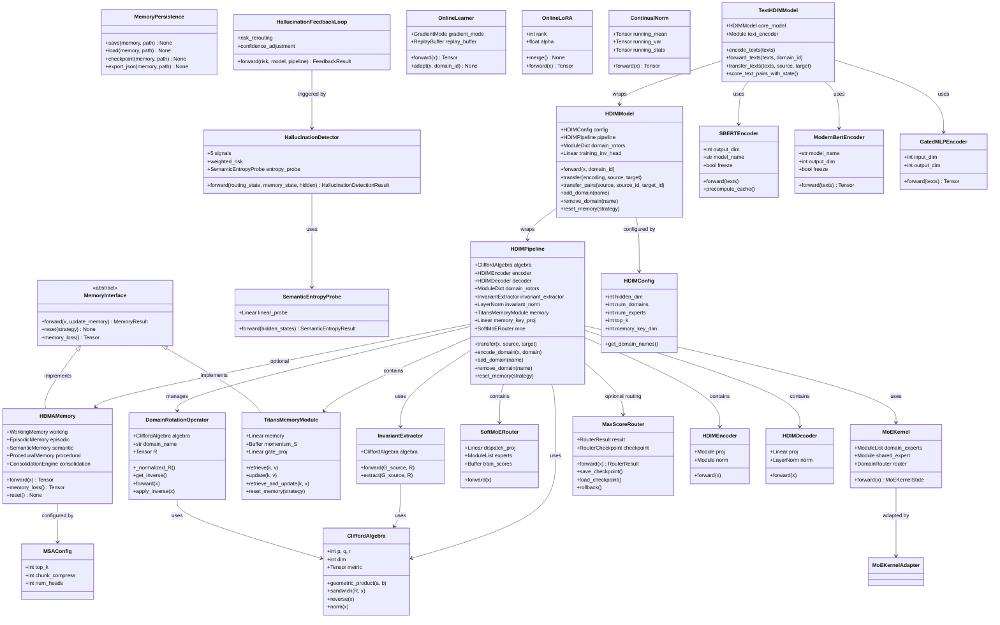
```mermaid
classDiagram
    %% Core Layer
    class CliffordAlgebra {
        +int p, q, r
        +int dim
        +Tensor metric
        +geometric_product(a, b)
        +sandwich(R, x)
        +reverse(x)
        +norm(x)
    }

    class DomainRotationOperator {
        +CliffordAlgebra algebra
        +str domain_name
        +Tensor R
        +_normalized_R()
        +get_inverse()
        +forward(x)
        +apply_inverse(x)
    }

    class InvariantExtractor {
        +CliffordAlgebra algebra
        +forward(G_source, R)
        +extract(G_source, R)
    }

    class MemoryInterface <<abstract>> {
        +forward(x, update_memory) MemoryResult
        +reset(strategy) None
        +memory_loss() Tensor
    }

    class TitansMemoryModule {
        +Linear memory
        +Buffer momentum_S
        +Linear gate_proj
        +retrieve(k, v)
        +update(k, v)
        +retrieve_and_update(k, v)
        +reset_memory(strategy)
    }

    class HBMAMemory {
        +WorkingMemory working
        +EpisodicMemory episodic
        +SemanticMemory semantic
        +ProceduralMemory procedural
        +ConsolidationEngine consolidation
        +forward(x) Tensor
        +memory_loss() Tensor
        +reset() None
    }

    class MSAConfig {
        +int top_k
        +int chunk_compress
        +int num_heads
    }

    class MemoryPersistence {
        +save(memory, path) None
        +load(memory, path) None
        +checkpoint(memory, path) None
        +export_json(memory, path) None
    }

    class SoftMoERouter {
        +Linear dispatch_proj
        +ModuleList experts
        +Buffer train_scores
        +forward(x)
    }

    class MoEKernel {
        +ModuleList domain_experts
        +Module shared_expert
        +DomainRouter router
        +forward(x) MoEKernelState
    }

    class MaxScoreRouter {
        +forward(x) RouterResult
        +RouterResult result
        +RouterCheckpoint checkpoint
        +save_checkpoint()
        +load_checkpoint()
        +rollback()
    }

    class HDIMEncoder {
        +Module proj
        +Module norm
        +forward(x)
    }

    class HDIMDecoder {
        +Linear proj
        +LayerNorm norm
        +forward(x)
    }

    class HallucinationDetector {
        +5 signals
        +weighted_risk
        +SemanticEntropyProbe entropy_probe
        +forward(routing_state, memory_state, hidden) HallucinationDetectionResult
    }

    class HallucinationFeedbackLoop {
        +risk_rerouting
        +confidence_adjustment
        +forward(risk, model, pipeline) FeedbackResult
    }

    class SemanticEntropyProbe {
        +Linear linear_probe
        +forward(hidden_states) SemanticEntropyResult
    }

    class OnlineLearner {
        +GradientMode gradient_mode
        +ReplayBuffer replay_buffer
        +forward(x) Tensor
        +adapt(x, domain_id) None
    }

    class OnlineLoRA {
        +int rank
        +float alpha
        +merge() None
        +forward(x) Tensor
    }

    class ContinualNorm {
        +Tensor running_mean
        +Tensor running_var
        +Tensor running_stats
        +forward(x) Tensor
    }

    class HDIMPipeline {
        +CliffordAlgebra algebra
        +HDIMEncoder encoder
        +HDIMDecoder decoder
        +ModuleDict domain_rotors
        +InvariantExtractor invariant_extractor
        +LayerNorm invariant_norm
        +TitansMemoryModule memory
        +Linear memory_key_proj
        +SoftMoERouter moe
        +transfer(x, source, target)
        +encode_domain(x, domain)
        +add_domain(name)
        +remove_domain(name)
        +reset_memory(strategy)
    }

    %% Core relations
    HDIMPipeline --> CliffordAlgebra : uses
    HDIMPipeline --> HDIMEncoder : contains
    HDIMPipeline --> HDIMDecoder : contains
    HDIMPipeline --> DomainRotationOperator : manages
    HDIMPipeline --> InvariantExtractor : uses
    HDIMPipeline --> TitansMemoryModule : contains
    HDIMPipeline --> HBMAMemory : optional
    HDIMPipeline --> SoftMoERouter : contains
    HDIMPipeline --> MoEKernel : uses
    HDIMPipeline --> MaxScoreRouter : optional routing
    InvariantExtractor --> CliffordAlgebra : uses
    DomainRotationOperator --> CliffordAlgebra : uses
    HallucinationDetector --> SemanticEntropyProbe : uses
    HallucinationFeedbackLoop --> HallucinationDetector : triggered by
    HBMAMemory --> MSAConfig : configured by
    MoEKernel --> MoEKernelAdapter : adapted by

    %% Memory interface hierarchy
    MemoryInterface <|-- TitansMemoryModule : implements
    MemoryInterface <|-- HBMAMemory : implements

    %% Model Layer
    class HDIMConfig {
        +int hidden_dim
        +int num_domains
        +int num_experts
        +int top_k
        +int memory_key_dim
        +get_domain_names()
    }

    class HDIMModel {
        +HDIMConfig config
        +HDIMPipeline pipeline
        +ModuleDict domain_rotors
        +Linear training_inv_head
        +forward(x, domain_id)
        +transfer(encoding, source, target)
        +transfer_pairs(source, source_id, target_id)
        +add_domain(name)
        +remove_domain(name)
        +reset_memory(strategy)
    }

    class TextHDIMModel {
        +HDIMModel core_model
        +Module text_encoder
        +encode_texts(texts)
        +forward_texts(texts, domain_id)
        +transfer_texts(texts, source, target)
        +score_text_pairs_with_state()
    }

    class SBERTEncoder {
        +int output_dim
        +str model_name
        +bool freeze
        +forward(texts)
        +precompute_cache()
    }

    class ModernBertEncoder {
        +str model_name
        +int output_dim
        +bool freeze
        +forward(texts) Tensor
    }

    class GatedMLPEncoder {
        +int input_dim
        +int output_dim
        +forward(texts) Tensor
    }

    %% Model relations
    HDIMModel --> HDIMPipeline : wraps
    HDIMModel --> HDIMConfig : configured by
    TextHDIMModel --> HDIMModel : wraps
    TextHDIMModel --> SBERTEncoder : uses
    TextHDIMModel --> ModernBertEncoder : uses
    TextHDIMModel --> GatedMLPEncoder : uses
```

---

## 2. Core Pipeline Flow

### 2.1 Полный pipeline transfer()

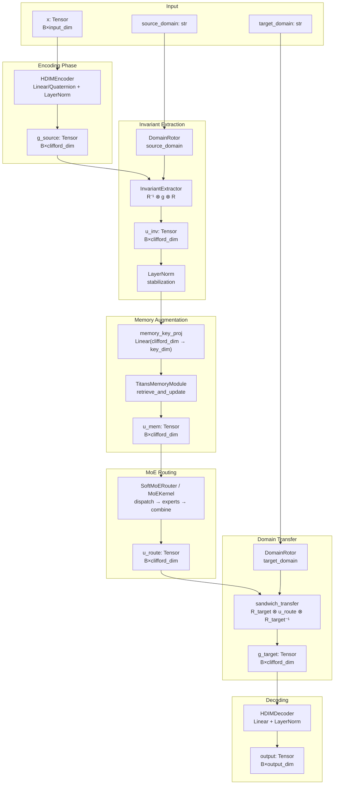
```mermaid
flowchart TD
    subgraph Input
        X["x: Tensor<br/>B×input_dim"]
        SD["source_domain: str"]
        TD["target_domain: str"]
    end

    subgraph Encoding["Encoding Phase"]
        E["HDIMEncoder<br/>Linear/Quaternion + LayerNorm"]
        G["g_source: Tensor<br/>B×clifford_dim"]
    end

    subgraph Invariant["Invariant Extraction"]
        R1["DomainRotor<br/>source_domain"]
        IE["InvariantExtractor<br/>R⁻¹ ⊗ g ⊗ R"]
        U["u_inv: Tensor<br/>B×clifford_dim"]
        LN["LayerNorm<br/>stabilization"]
    end

    subgraph Memory["Memory Augmentation"]
        MK["memory_key_proj<br/>Linear(clifford_dim → key_dim)"]
        TM["TitansMemoryModule<br/>retrieve_and_update"]
        UM["u_mem: Tensor<br/>B×clifford_dim"]
    end

    subgraph MoE["MoE Routing"]
        SM["SoftMoERouter / MoEKernel<br/>dispatch → experts → combine"]
        UR["u_route: Tensor<br/>B×clifford_dim"]
    end

    subgraph Transfer["Domain Transfer"]
        ST["sandwich_transfer<br/>R_target ⊗ u_route ⊗ R_target⁻¹"]
        R2["DomainRotor<br/>target_domain"]
        GT["g_target: Tensor<br/>B×clifford_dim"]
    end

    subgraph Output["Decoding"]
        D["HDIMDecoder<br/>Linear + LayerNorm"]
        OUT["output: Tensor<br/>B×output_dim"]
    end

    X --> E --> G
    G --> IE
    SD --> R1 --> IE
    IE --> U --> LN --> MK
    MK --> TM
    TM --> UM --> SM --> UR
    UR --> ST
    TD --> R2 --> ST
    ST --> GT --> D --> OUT
```

### 2.2 Детальный алгоритм HDIMPipeline.transfer()

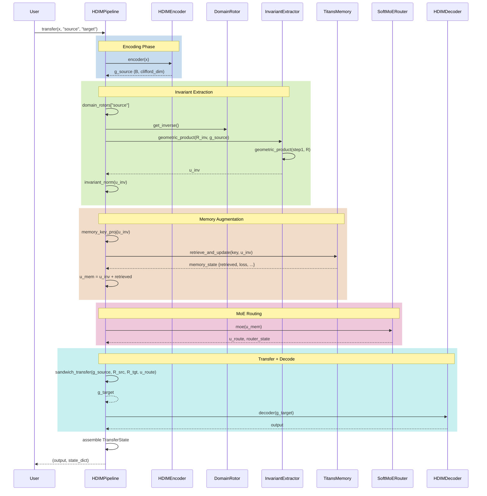
```mermaid
sequenceDiagram
    participant User
    participant Pipeline as HDIMPipeline
    participant Encoder as HDIMEncoder
    participant Rotor as DomainRotor
    participant InvEx as InvariantExtractor
    participant Memory as TitansMemory
    participant MoE as SoftMoERouter
    participant Decoder as HDIMDecoder

    User->>Pipeline: transfer(x, "source", "target")

    rect rgb(200, 220, 240)
        Note over Pipeline,Encoder: Encoding Phase
        Pipeline->>Encoder: encoder(x)
        Encoder-->>Pipeline: g_source (B, clifford_dim)
    end

    rect rgb(220, 240, 200)
        Note over Pipeline,InvEx: Invariant Extraction
        Pipeline->>Pipeline: domain_rotors["source"]
        Pipeline->>Rotor: get_inverse()
        Pipeline->>InvEx: geometric_product(R_inv, g_source)
        InvEx->>InvEx: geometric_product(step1, R)
        InvEx-->>Pipeline: u_inv
        Pipeline->>Pipeline: invariant_norm(u_inv)
    end

    rect rgb(240, 220, 200)
        Note over Pipeline,Memory: Memory Augmentation
        Pipeline->>Pipeline: memory_key_proj(u_inv)
        Pipeline->>Memory: retrieve_and_update(key, u_inv)
        Memory-->>Pipeline: memory_state {retrieved, loss, ...}
        Pipeline->>Pipeline: u_mem = u_inv + retrieved
    end

    rect rgb(240, 200, 220)
        Note over Pipeline,MoE: MoE Routing
        Pipeline->>MoE: moe(u_mem)
        MoE-->>Pipeline: u_route, router_state
    end

    rect rgb(200, 240, 240)
        Note over Pipeline,Decoder: Transfer + Decode
        Pipeline->>Pipeline: sandwich_transfer(g_source, R_src, R_tgt, u_route)
        Pipeline-->>Pipeline: g_target
        Pipeline->>Decoder: decoder(g_target)
        Decoder-->>Pipeline: output
    end

    Pipeline->>Pipeline: assemble TransferState
    Pipeline-->>User: (output, state_dict)
```

### 2.3 Invariant Extraction Detail

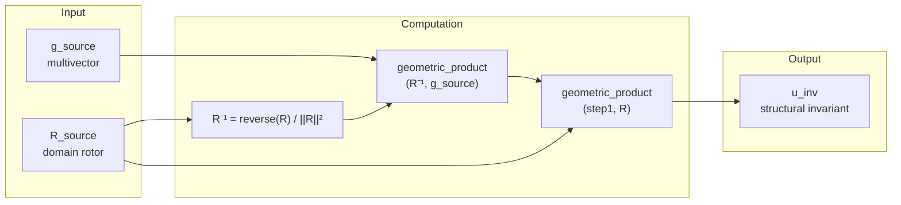
```mermaid
flowchart LR
    subgraph Input
        G["g_source<br/>multivector"]
        R["R_source<br/>domain rotor"]
    end

    subgraph Computation
        INV["R⁻¹ = reverse(R) / ||R||²"]
        GP1["geometric_product<br/>(R⁻¹, g_source)"]
        GP2["geometric_product<br/>(step1, R)"]
    end

    subgraph Output
        U["u_inv<br/>structural invariant"]
    end

    R --> INV
    G --> GP1
    INV --> GP1
    GP1 --> GP2
    R --> GP2
    GP2 --> U
```

---

## 3. Training Loop Flow

### 3.1 Training Loop Overview

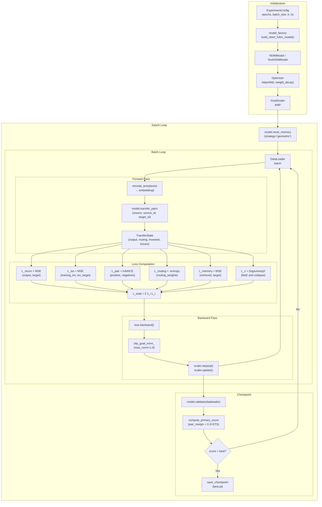
```mermaid
flowchart TD
    subgraph Init["Initialization"]
        CFG["ExperimentConfig<br/>epochs, batch_size, lr, λs"]
        FACT["model_factory<br/>build_sbert_hdim_model()"]
        MODEL["HDIMModel / TextHDIMModel"]
        OPT["Optimizer<br/>AdamW(lr, weight_decay)"]
        SCALER["GradScaler<br/>AMP"]
    end

    subgraph EpochLoop["Epoch Loop"]
        RESET["model.reset_memory<br/>(strategy='geometric')"]

        subgraph BatchLoop["Batch Loop"]
            BATCH["DataLoader<br/>batch"]

            subgraph Forward["Forward Pass"]
                ENC["encode_texts(texts)<br/>→ embeddings"]
                TRANS["model.transfer_pairs<br/>(source, source_id, target_id)"]
                STATE["TransferState<br/>{output, routing, invariant, losses}"]
            end

            subgraph Losses["Loss Computation"]
                L1["L_recon = MSE<br/>(output, target)"]
                L2["L_iso = MSE<br/>(training_inv, iso_target)"]
                L3["L_pair = InfoNCE<br/>(positive, negatives)"]
                L4["L_routing = -entropy<br/>(routing_weights)"]
                L5["L_memory = MSE<br/>(retrieved, target)"]
                L6["L_z = (logsumexp)²<br/>(MoE anti-collapse)"]
                LT["L_total = Σ λ_i L_i"]
            end

            subgraph Backward["Backward Pass"]
                GRAD["loss.backward()"]
                CLIP["clip_grad_norm_<br/>(max_norm=1.0)"]
                STEP["scaler.step(opt)<br/>scaler.update()"]
            end
        end

        subgraph Checkpoint["Checkpoint"]
            EVAL["model.validate(dataloader)"]
            SCORE["compute_primary_score<br/>(pair_margin + 0.3×STS)"]
            BEST{"score > best?"}
            SAVE["save_checkpoint<br/>(best.pt)"]
        end
    end

    CFG --> FACT --> MODEL
    MODEL --> OPT
    OPT --> SCALER

    SCALER --> RESET
    RESET --> BATCH
    BATCH --> ENC --> TRANS --> STATE
    STATE --> L1 & L2 & L3 & L4 & L5 & L6 --> LT
    LT --> GRAD --> CLIP --> STEP
    STEP --> BATCH

    STEP --> EVAL --> SCORE --> BEST
    BEST -->|Yes| SAVE
    BEST -->|No| BATCH
```

### 3.2 Loss Computation Detail

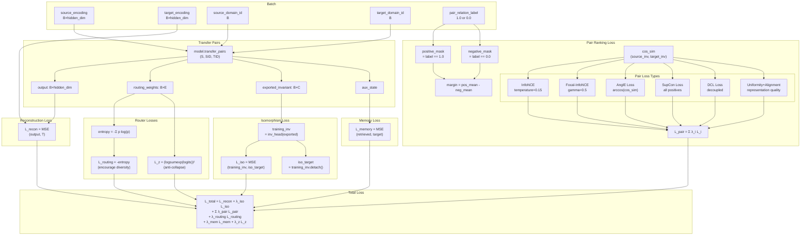
```mermaid
flowchart TD
    subgraph Input["Batch"]
        S["source_encoding<br/>B×hidden_dim"]
        T["target_encoding<br/>B×hidden_dim"]
        SID["source_domain_id<br/>B"]
        TID["target_domain_id<br/>B"]
        LABEL["pair_relation_label<br/>1.0 or 0.0"]
    end

    subgraph Transfer["Transfer Pairs"]
        TP["model.transfer_pairs<br/>(S, SID, TID)"]
        OUT["output: B×hidden_dim"]
        ROUT["routing_weights: B×E"]
        INV["exported_invariant: B×C"]
        STATE["aux_state"]
    end

    subgraph ReconLoss["Reconstruction Loss"]
        L_RECON["L_recon = MSE<br/>(output, T)"]
    end

    subgraph IsoLoss["Isomorphism Loss"]
        TRAIN_INV["training_inv<br/>= inv_head(exported)"]
        ISO_TGT["iso_target<br/>= training_inv.detach()"]
        L_ISO["L_iso = MSE<br/>(training_inv, iso_target)"]
    end

    subgraph PairLoss["Pair Ranking Loss"]
        POS["positive_mask<br/>= label == 1.0"]
        NEG["negative_mask<br/>= label == 0.0"]
        SIM["cos_sim<br/>(source_inv, target_inv)"]
        MARGIN["margin = pos_mean - neg_mean"]

        subgraph PairTypes["Pair Loss Types"]
            P1["InfoNCE<br/>temperature=0.15"]
            P2["Focal-InfoNCE<br/>gamma=0.5"]
            P3["AnglE Loss<br/>arccos(cos_sim)"]
            P4["SupCon Loss<br/>all positives"]
            P5["DCL Loss<br/>decoupled"]
            P6["Uniformity+Alignment<br/>representation quality"]
        end

        L_PAIR["L_pair = Σ λ_i L_i"]
    end

    subgraph RouterLoss["Router Losses"]
        ENT["entropy = -Σ p log(p)"]
        L_ROUTING["L_routing = -entropy<br/>(encourage diversity)"]
        L_Z["L_z = (logsumexp(logits))²<br/>(anti-collapse)"]
    end

    subgraph MemoryLoss["Memory Loss"]
        L_MEM["L_memory = MSE<br/>(retrieved, target)"]
    end

    subgraph Total["Total Loss"]
        L_TOTAL["L_total = L_recon + λ_iso L_iso<br/>+ Σ λ_pair L_pair<br/>+ λ_routing L_routing<br/>+ λ_mem L_mem + λ_z L_z"]
    end

    S & SID & TID --> TP --> OUT & ROUT & INV & STATE
    OUT & T --> L_RECON
    INV --> TRAIN_INV --> L_ISO
    TRAIN_INV --> ISO_TGT

    LABEL --> POS & NEG
    POS & NEG --> MARGIN
    SIM --> P1 & P2 & P3 & P4 & P5 & P6 --> L_PAIR

    ROUT --> ENT --> L_ROUTING
    ROUT --> L_Z

    STATE --> L_MEM

    L_RECON & L_ISO & L_PAIR & L_ROUTING & L_Z & L_MEM --> L_TOTAL
```

---

## 4. Model Factory Flow

### 4.1 Factory Functions

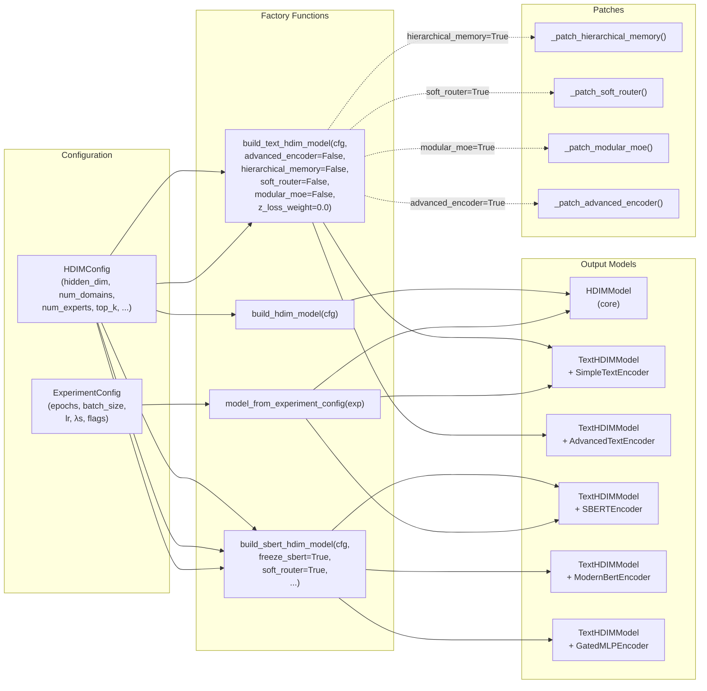
```mermaid
flowchart LR
    subgraph Config["Configuration"]
        HC["HDIMConfig<br/>(hidden_dim, num_domains,<br/>num_experts, top_k, ...)"]
        EC["ExperimentConfig<br/>(epochs, batch_size,<br/>lr, λs, flags)"]
    end

    subgraph Factories["Factory Functions"]
        F1["build_hdim_model(cfg)"]
        F2["build_text_hdim_model(cfg,<br/>advanced_encoder=False,<br/>hierarchical_memory=False,<br/>soft_router=False,<br/>modular_moe=False,<br/>z_loss_weight=0.0)"]
        F3["build_sbert_hdim_model(cfg,<br/>freeze_sbert=True,<br/>soft_router=True,<br/>...)"]
        F4["model_from_experiment_config(exp)"]
    end

    subgraph Models["Output Models"]
        M1["HDIMModel<br/>(core)"]
        M2["TextHDIMModel<br/>+ SimpleTextEncoder"]
        M3["TextHDIMModel<br/>+ AdvancedTextEncoder"]
        M4["TextHDIMModel<br/>+ SBERTEncoder"]
        M5["TextHDIMModel<br/>+ ModernBertEncoder"]
        M6["TextHDIMModel<br/>+ GatedMLPEncoder"]
    end

    HC --> F1 --> M1
    HC --> F2 --> M2
    HC --> F2 --> M3
    HC --> F3 --> M4
    HC --> F3 --> M5
    HC --> F3 --> M6
    EC --> F4 --> M1 & M2 & M4

    subgraph Patches["Patches"]
        P1["_patch_hierarchical_memory()"]
        P2["_patch_soft_router()"]
        P3["_patch_modular_moe()"]
        P4["_patch_advanced_encoder()"]
    end

    F2 -.->|"hierarchical_memory=True"| P1
    F2 -.->|"soft_router=True"| P2
    F2 -.->|"modular_moe=True"| P3
    F2 -.->|"advanced_encoder=True"| P4
```

### 4.2 TextHDIMModel Assembly

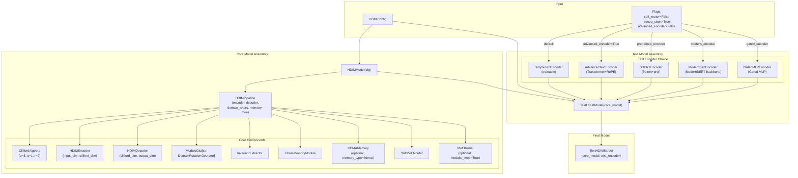
```mermaid
flowchart TD
    subgraph Input["Input"]
        CFG["HDIMConfig"]
        FLAGS["Flags:<br/>soft_router=False<br/>freeze_sbert=True<br/>advanced_encoder=False"]
    end

    subgraph Core["Core Model Assembly"]
        HDIM["HDIMModel(cfg)"]
        PIPE["HDIMPipeline<br/>(encoder, decoder,<br/>domain_rotors, memory, moe)"]

        subgraph CoreComponents["Core Components"]
            ALG["CliffordAlgebra<br/>(p=3, q=1, r=0)"]
            ENC["HDIMEncoder<br/>(input_dim, clifford_dim)"]
            DEC["HDIMDecoder<br/>(clifford_dim, output_dim)"]
            ROT["ModuleDict[str,<br/>DomainRotationOperator]"]
            INV["InvariantExtractor"]
            MEM["TitansMemoryModule"]
            HBMAMEM["HBMAMemory<br/>(optional, memory_type='hbma')"]
            MOE["SoftMoERouter"]
            MOEK["MoEKernel<br/>(optional, modular_moe=True)"]
        end
    end

    subgraph Text["Text Model Assembly"]
        TEXT["TextHDIMModel(core_model)"]

        subgraph EncoderChoice["Text Encoder Choice"]
            SIMPLE["SimpleTextEncoder<br/>(trainable)"]
            ADV["AdvancedTextEncoder<br/>(Transformer+RoPE)"]
            SBERT["SBERTEncoder<br/>(frozen+proj)"]
            MODERN["ModernBertEncoder<br/>(ModernBERT backbone)"]
            GMLP["GatedMLPEncoder<br/>(Gated MLP)"]
        end
    end

    subgraph Output["Final Model"]
        MODEL["TextHDIMModel<br/>{core_model, text_encoder}"]
    end

    CFG --> HDIM --> PIPE
    PIPE --> ALG & ENC & DEC & ROT & INV & MEM & HBMAMEM & MOE & MOEK

    CFG --> TEXT
    FLAGS -->|"default"| SIMPLE
    FLAGS -->|"advanced_encoder=True"| ADV
    FLAGS -->|"pretrained_encoder"| SBERT
    FLAGS -->|"modern_encoder"| MODERN
    FLAGS -->|"gated_encoder"| GMLP
    TEXT --> MODEL
    HDIM --> TEXT
    SIMPLE & ADV & SBERT & MODERN & GMLP --> TEXT
```

---

## 5. API Sequence Diagrams

### 5.1 Forward Texts

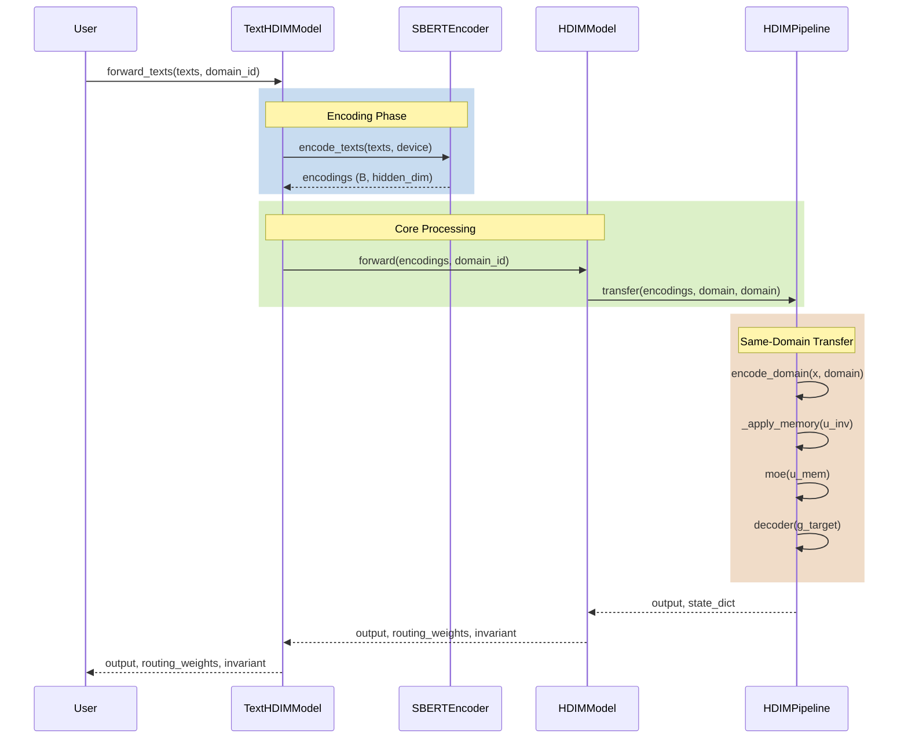
```mermaid
sequenceDiagram
    participant User
    participant TextModel as TextHDIMModel
    participant Encoder as SBERTEncoder
    participant Core as HDIMModel
    participant Pipeline as HDIMPipeline

    User->>TextModel: forward_texts(texts, domain_id)

    rect rgb(200, 220, 240)
        Note over TextModel,Encoder: Encoding Phase
        TextModel->>Encoder: encode_texts(texts, device)
        Encoder-->>TextModel: encodings (B, hidden_dim)
    end

    rect rgb(220, 240, 200)
        Note over TextModel,Core: Core Processing
        TextModel->>Core: forward(encodings, domain_id)
        Core->>Pipeline: transfer(encodings, domain, domain)
    end

    rect rgb(240, 220, 200)
        Note over Pipeline: Same-Domain Transfer
        Pipeline->>Pipeline: encode_domain(x, domain)
        Pipeline->>Pipeline: _apply_memory(u_inv)
        Pipeline->>Pipeline: moe(u_mem)
        Pipeline->>Pipeline: decoder(g_target)
    end

    Pipeline-->>Core: output, state_dict
    Core-->>TextModel: output, routing_weights, invariant
    TextModel-->>User: output, routing_weights, invariant
```

### 5.2 Transfer Texts

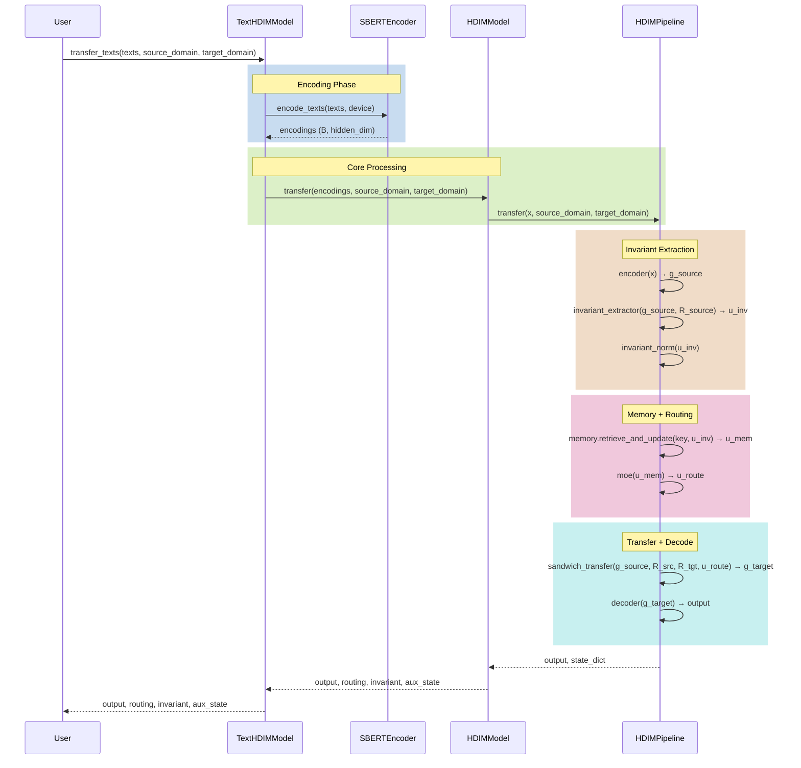
```mermaid
sequenceDiagram
    participant User
    participant TextModel as TextHDIMModel
    participant Encoder as SBERTEncoder
    participant Core as HDIMModel
    participant Pipeline as HDIMPipeline

    User->>TextModel: transfer_texts(texts, source_domain, target_domain)

    rect rgb(200, 220, 240)
        Note over TextModel,Encoder: Encoding Phase
        TextModel->>Encoder: encode_texts(texts, device)
        Encoder-->>TextModel: encodings (B, hidden_dim)
    end

    rect rgb(220, 240, 200)
        Note over TextModel,Core: Core Processing
        TextModel->>Core: transfer(encodings, source_domain, target_domain)
        Core->>Pipeline: transfer(x, source_domain, target_domain)
    end

    rect rgb(240, 220, 200)
        Note over Pipeline: Invariant Extraction
        Pipeline->>Pipeline: encoder(x) → g_source
        Pipeline->>Pipeline: invariant_extractor(g_source, R_source) → u_inv
        Pipeline->>Pipeline: invariant_norm(u_inv)
    end

    rect rgb(240, 200, 220)
        Note over Pipeline: Memory + Routing
        Pipeline->>Pipeline: memory.retrieve_and_update(key, u_inv) → u_mem
        Pipeline->>Pipeline: moe(u_mem) → u_route
    end

    rect rgb(200, 240, 240)
        Note over Pipeline: Transfer + Decode
        Pipeline->>Pipeline: sandwich_transfer(g_source, R_src, R_tgt, u_route) → g_target
        Pipeline->>Pipeline: decoder(g_target) → output
    end

    Pipeline-->>Core: output, state_dict
    Core-->>TextModel: output, routing, invariant, aux_state
    TextModel-->>User: output, routing, invariant, aux_state
```

### 5.3 Score Text Pairs

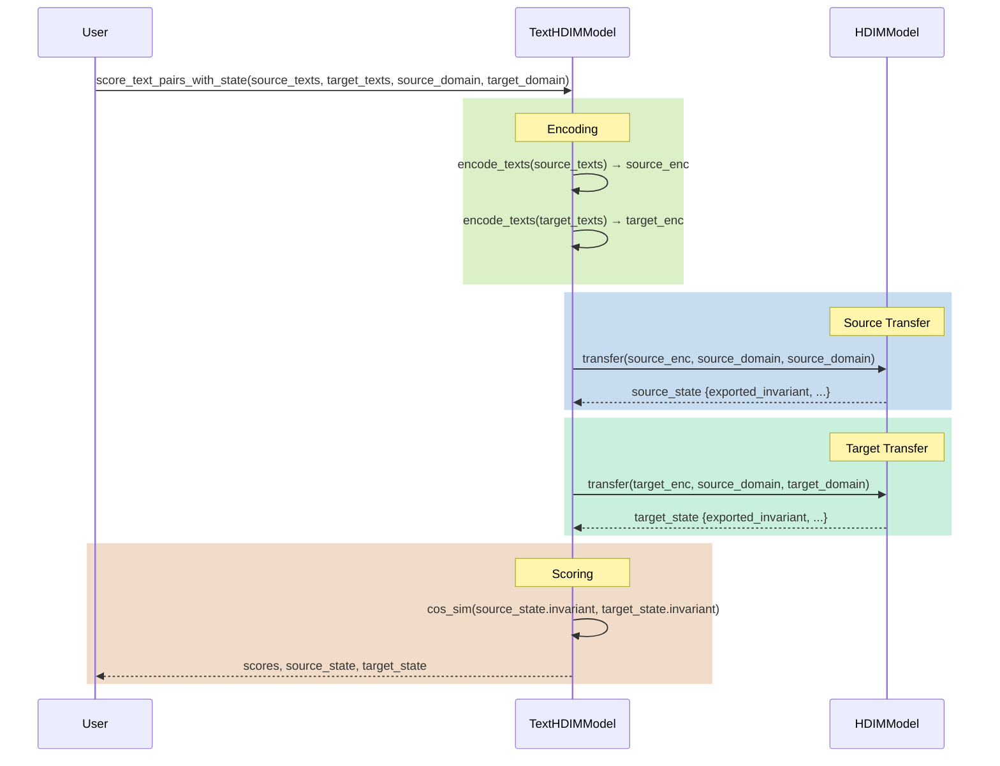
```mermaid
sequenceDiagram
    participant User
    participant TextModel as TextHDIMModel
    participant Core as HDIMModel

    User->>TextModel: score_text_pairs_with_state(source_texts, target_texts, source_domain, target_domain)

    rect rgb(220, 240, 200)
        Note over TextModel: Encoding
        TextModel->>TextModel: encode_texts(source_texts) → source_enc
        TextModel->>TextModel: encode_texts(target_texts) → target_enc
    end

    rect rgb(200, 220, 240)
        Note over Core: Source Transfer
        TextModel->>Core: transfer(source_enc, source_domain, source_domain)
        Core-->>TextModel: source_state {exported_invariant, ...}
    end

    rect rgb(200, 240, 220)
        Note over Core: Target Transfer
        TextModel->>Core: transfer(target_enc, source_domain, target_domain)
        Core-->>TextModel: target_state {exported_invariant, ...}
    end

    rect rgb(240, 220, 200)
        Note over TextModel: Scoring
        TextModel->>TextModel: cos_sim(source_state.invariant, target_state.invariant)
        TextModel-->>User: scores, source_state, target_state
    end
```

---

## 6. Loss Computation Flow

### 6.1 InfoNCE Loss

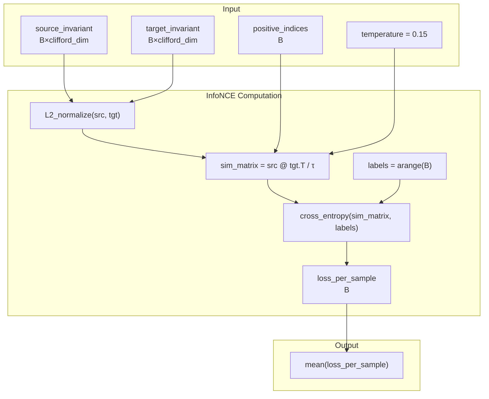
```mermaid
flowchart TD
    subgraph Input["Input"]
        SRC["source_invariant<br/>B×clifford_dim"]
        TGT["target_invariant<br/>B×clifford_dim"]
        POS["positive_indices<br/>B"]
        TEMP["temperature = 0.15"]
    end

    subgraph Computation["InfoNCE Computation"]
        NORM["L2_normalize(src, tgt)"]
        SIM["sim_matrix = src @ tgt.T / τ"]
        LABELS["labels = arange(B)"]
        CE["cross_entropy(sim_matrix, labels)"]
        LOSS["loss_per_sample<br/>B"]
    end

    subgraph Output["Output"]
        MEAN["mean(loss_per_sample)"]
    end

    SRC & TGT --> NORM --> SIM
    POS --> SIM
    TEMP --> SIM
    SIM & LABELS --> CE --> LOSS --> MEAN
```

### 6.2 Focal-InfoNCE Loss

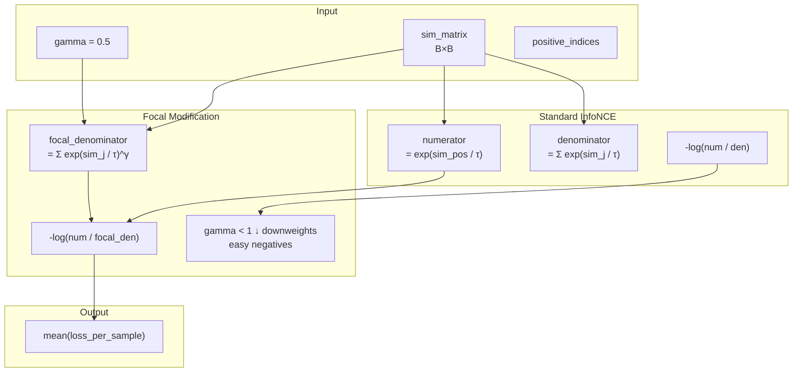
```mermaid
flowchart TD
    subgraph Input["Input"]
        SIM["sim_matrix<br/>B×B"]
        GAMMA["gamma = 0.5"]
        POS["positive_indices"]
    end

    subgraph Standard["Standard InfoNCE"]
        NUM["numerator<br/>= exp(sim_pos / τ)"]
        DEN["denominator<br/>= Σ exp(sim_j / τ)"]
        STD_LOSS["-log(num / den)"]
    end

    subgraph Focal["Focal Modification"]
        FOCAL_DEN["focal_denominator<br/>= Σ exp(sim_j / τ)^γ"]
        FOCAL_LOSS["-log(num / focal_den)"]
        NOTE["gamma < 1 ↓ downweights<br/>easy negatives"]
    end

    subgraph Output["Output"]
        MEAN["mean(loss_per_sample)"]
    end

    SIM --> NUM & DEN
    STD_LOSS --> NOTE
    SIM --> FOCAL_DEN
    GAMMA --> FOCAL_DEN
    NUM & FOCAL_DEN --> FOCAL_LOSS --> MEAN
```

### 6.3 MoE Z-Loss

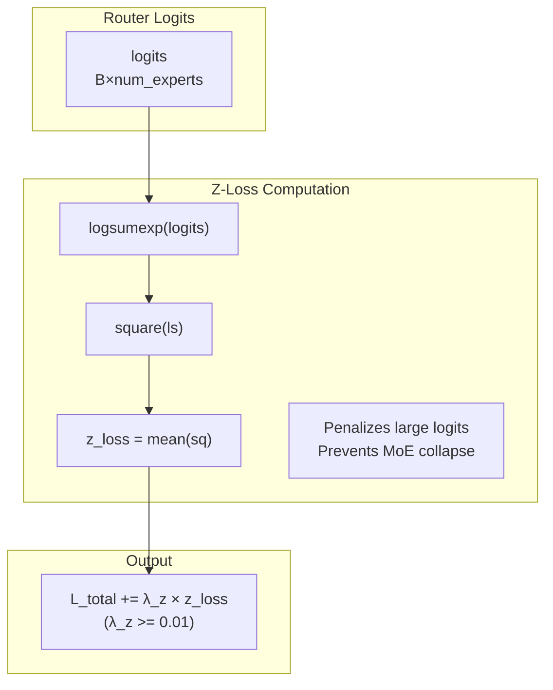
```mermaid
flowchart TD
    subgraph Input["Router Logits"]
        LOGITS["logits<br/>B×num_experts"]
    end

    subgraph Computation["Z-Loss Computation"]
        LS["logsumexp(logits)"]
        SQ["square(ls)"]
        Z_LOSS["z_loss = mean(sq)"]
        NOTE["Penalizes large logits<br/>Prevents MoE collapse"]
    end

    subgraph Output["Output"]
        ADD["L_total += λ_z × z_loss<br/>(λ_z >= 0.01)"]
    end

    LOGITS --> LS --> SQ --> Z_LOSS --> ADD
```

---

## 7. Memory Flow (Titans)

### 7.1 Titans Memory Architecture

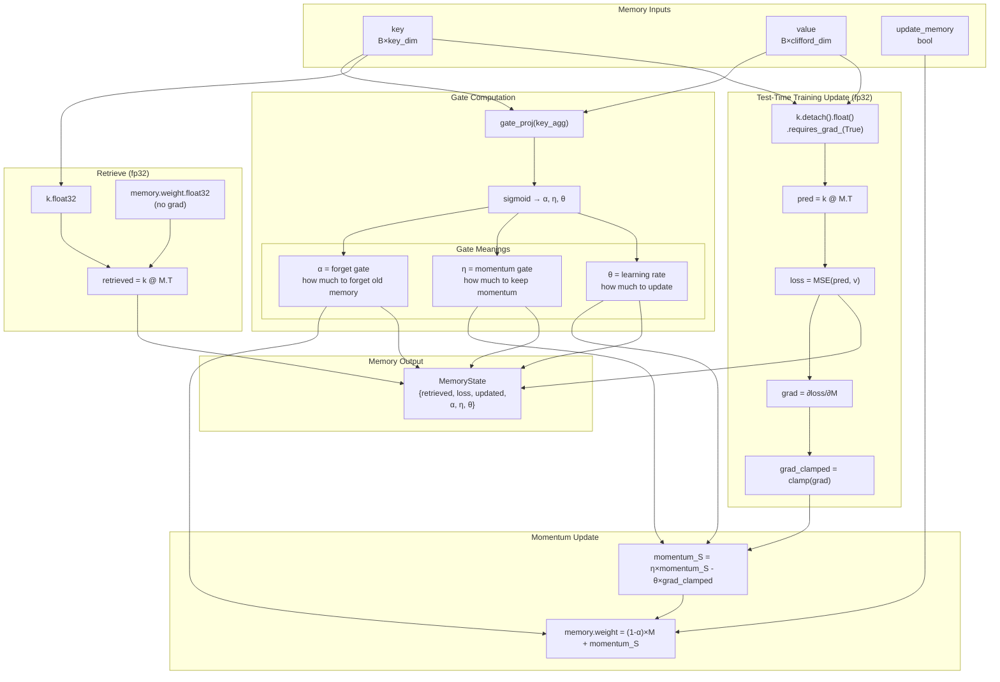
```mermaid
flowchart TD
    subgraph Inputs["Memory Inputs"]
        K["key<br/>B×key_dim"]
        V["value<br/>B×clifford_dim"]
        UPDATE["update_memory<br/>bool"]
    end

    subgraph Gates["Gate Computation"]
        GP["gate_proj(key_agg)"]
        SIG["sigmoid → α, η, θ"]

        subgraph GateMeanings["Gate Meanings"]
            ALPHA["α = forget gate<br/>how much to forget old memory"]
            ETA["η = momentum gate<br/>how much to keep momentum"]
            THETA["θ = learning rate<br/>how much to update"]
        end
    end

    subgraph Retrieval["Retrieve (fp32)"]
        K_FP32["k.float32"]
        M_FP32["memory.weight.float32<br/>(no grad)"]
        RET["retrieved = k @ M.T"]
    end

    subgraph TTT["Test-Time Training Update (fp32)"]
        K2["k.detach().float()<br/>.requires_grad_(True)"]
        PRED["pred = k @ M.T"]
        MSE["loss = MSE(pred, v)"]
        GRAD["grad = ∂loss/∂M"]
        CLAMP["grad_clamped = clamp(grad)"]
    end

    subgraph Momentum["Momentum Update"]
        MOM_NEW["momentum_S = η×momentum_S - θ×grad_clamped"]
        MEM_NEW["memory.weight = (1-α)×M + momentum_S"]
    end

    subgraph Output["Memory Output"]
        STATE["MemoryState<br/>{retrieved, loss, updated,<br/>α, η, θ}"]
    end

    K & V --> GP --> SIG
    SIG --> ALPHA & ETA & THETA

    K --> K_FP32 --> RET
    M_FP32 --> RET

    K & V --> K2 --> PRED --> MSE --> GRAD --> CLAMP
    CLAMP --> MOM_NEW --> MEM_NEW

    ETA --> MOM_NEW
    THETA --> MOM_NEW
    ALPHA --> MEM_NEW

    RET --> STATE
    MSE --> STATE
    THETA & ETA & ALPHA --> STATE
    UPDATE --> MEM_NEW
```

### 7.2 Memory Reset Strategies

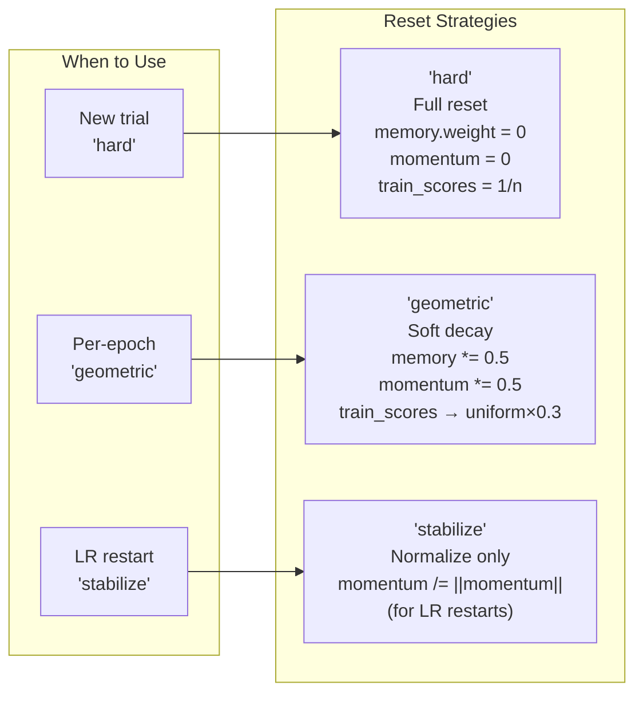
```mermaid
flowchart LR
    subgraph Strategies["Reset Strategies"]
        HARD["'hard'<br/>Full reset<br/>memory.weight = 0<br/>momentum = 0<br/>train_scores = 1/n"]
        GEO["'geometric'<br/>Soft decay<br/>memory *= 0.5<br/>momentum *= 0.5<br/>train_scores → uniform×0.3"]
        STAB["'stabilize'<br/>Normalize only<br/>momentum /= ||momentum||<br/>(for LR restarts)"]
    end

    subgraph When["When to Use"]
        EPOCH["Per-epoch<br/>'geometric'"]
        LR_RESTART["LR restart<br/>'stabilize'"]
        NEW_TRIAL["New trial<br/>'hard'"]
    end

    EPOCH --> GEO
    LR_RESTART --> STAB
    NEW_TRIAL --> HARD
```

---

## 8. Data Structures

### 8.1 TransferState

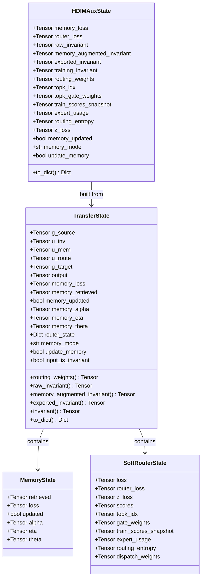
```mermaid
classDiagram
    class TransferState {
        +Tensor g_source
        +Tensor u_inv
        +Tensor u_mem
        +Tensor u_route
        +Tensor g_target
        +Tensor output
        +Tensor memory_loss
        +Tensor memory_retrieved
        +bool memory_updated
        +Tensor memory_alpha
        +Tensor memory_eta
        +Tensor memory_theta
        +Dict router_state
        +str memory_mode
        +bool update_memory
        +bool input_is_invariant

        +routing_weights() Tensor
        +raw_invariant() Tensor
        +memory_augmented_invariant() Tensor
        +exported_invariant() Tensor
        +invariant() Tensor
        +to_dict() Dict
    }

    class MemoryState {
        +Tensor retrieved
        +Tensor loss
        +bool updated
        +Tensor alpha
        +Tensor eta
        +Tensor theta
    }

    class SoftRouterState {
        +Tensor loss
        +Tensor router_loss
        +Tensor z_loss
        +Tensor scores
        +Tensor topk_idx
        +Tensor gate_weights
        +Tensor train_scores_snapshot
        +Tensor expert_usage
        +Tensor routing_entropy
        +Tensor dispatch_weights
    }

    class HDIMAuxState {
        +Tensor memory_loss
        +Tensor router_loss
        +Tensor raw_invariant
        +Tensor memory_augmented_invariant
        +Tensor exported_invariant
        +Tensor training_invariant
        +Tensor routing_weights
        +Tensor topk_idx
        +Tensor topk_gate_weights
        +Tensor train_scores_snapshot
        +Tensor expert_usage
        +Tensor routing_entropy
        +Tensor z_loss
        +bool memory_updated
        +str memory_mode
        +bool update_memory

        +to_dict() Dict
    }

    TransferState --> MemoryState : contains
    TransferState --> SoftRouterState : contains
    HDIMAuxState --> TransferState : built from
```

### 8.2 HDIMConfig & MoEKernelConfig

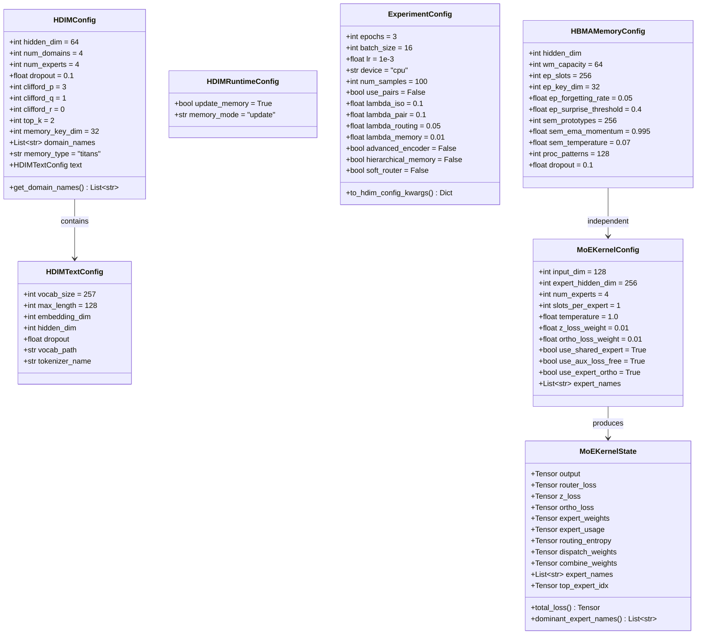
```mermaid
classDiagram
    class HDIMConfig {
        +int hidden_dim = 64
        +int num_domains = 4
        +int num_experts = 4
        +float dropout = 0.1
        +int clifford_p = 3
        +int clifford_q = 1
        +int clifford_r = 0
        +int top_k = 2
        +int memory_key_dim = 32
        +List~str~ domain_names
        +str memory_type = "titans"
        +HDIMTextConfig text

        +get_domain_names() List~str~
    }

    class HDIMTextConfig {
        +int vocab_size = 257
        +int max_length = 128
        +int embedding_dim
        +int hidden_dim
        +float dropout
        +str vocab_path
        +str tokenizer_name
    }

    class HDIMRuntimeConfig {
        +bool update_memory = True
        +str memory_mode = "update"
    }

    class ExperimentConfig {
        +int epochs = 3
        +int batch_size = 16
        +float lr = 1e-3
        +str device = "cpu"
        +int num_samples = 100
        +bool use_pairs = False
        +float lambda_iso = 0.1
        +float lambda_pair = 0.1
        +float lambda_routing = 0.05
        +float lambda_memory = 0.01
        +bool advanced_encoder = False
        +bool hierarchical_memory = False
        +bool soft_router = False

        +to_hdim_config_kwargs() Dict
    }

    class MoEKernelConfig {
        +int input_dim = 128
        +int expert_hidden_dim = 256
        +int num_experts = 4
        +int slots_per_expert = 1
        +float temperature = 1.0
        +float z_loss_weight = 0.01
        +float ortho_loss_weight = 0.01
        +bool use_shared_expert = True
        +bool use_aux_loss_free = True
        +bool use_expert_ortho = True
        +List~str~ expert_names
    }

    class MoEKernelState {
        +Tensor output
        +Tensor router_loss
        +Tensor z_loss
        +Tensor ortho_loss
        +Tensor expert_weights
        +Tensor expert_usage
        +Tensor routing_entropy
        +Tensor dispatch_weights
        +Tensor combine_weights
        +List~str~ expert_names
        +Tensor top_expert_idx
        +total_loss() Tensor
        +dominant_expert_names() List~str~
    }

    class HBMAMemoryConfig {
        +int hidden_dim
        +int wm_capacity = 64
        +int ep_slots = 256
        +int ep_key_dim = 32
        +float ep_forgetting_rate = 0.05
        +float ep_surprise_threshold = 0.4
        +int sem_prototypes = 256
        +float sem_ema_momentum = 0.995
        +float sem_temperature = 0.07
        +int proc_patterns = 128
        +float dropout = 0.1
    }

    HDIMConfig --> HDIMTextConfig : contains
    MoEKernelConfig --> MoEKernelState : produces
    HBMAMemoryConfig --> MoEKernelConfig : independent
```

---

## 9. Hallucination Detection & Feedback Flow

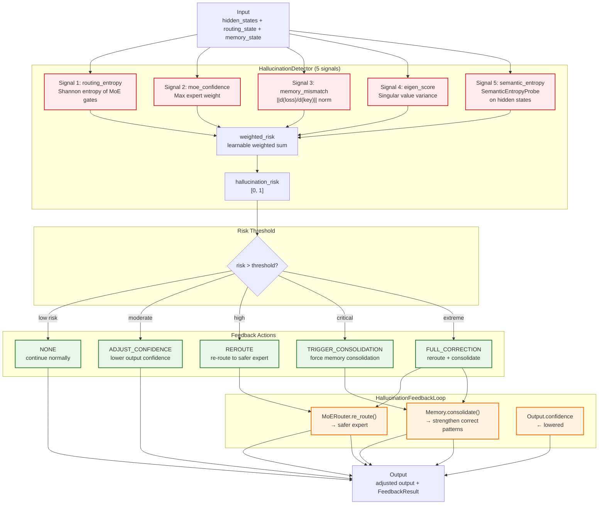
```mermaid
flowchart TD
    INPUT["Input<br/>hidden_states + routing_state + memory_state"]

    subgraph Detector["HallucinationDetector (5 signals)"]
        S1["Signal 1: routing_entropy<br/>Shannon entropy of MoE gates"]
        S2["Signal 2: moe_confidence<br/>Max expert weight"]
        S3["Signal 3: memory_mismatch<br/>||d(loss)/d(key)|| norm"]
        S4["Signal 4: eigen_score<br/>Singular value variance"]
        S5["Signal 5: semantic_entropy<br/>SemanticEntropyProbe<br/>on hidden states"]
        COMBINE["weighted_risk<br/>learnable weighted sum"]
        RISK["hallucination_risk<br/>[0, 1]"]
    end

    subgraph Decision["Risk Threshold"]
        CHECK{"risk > threshold?"}
    end

    subgraph FeedbackLoop["HallucinationFeedbackLoop"]
        REROUTE["MoERouter.re_route()<br/>→ safer expert"]
        CONSOLIDATE["Memory.consolidate()<br/>→ strengthen correct patterns"]
        CONFIDENCE["Output.confidence<br/>← lowered"]
    end

    subgraph Actions["Feedback Actions"]
        ACT_NONE["NONE<br/>continue normally"]
        ACT_ADJUST["ADJUST_CONFIDENCE<br/>lower output confidence"]
        ACT_REROUTE["REROUTE<br/>re-route to safer expert"]
        ACT_CONSOLIDATE["TRIGGER_CONSOLIDATION<br/>force memory consolidation"]
        ACT_FULL["FULL_CORRECTION<br/>reroute + consolidate"]
    end

    OUTPUT["Output<br/>adjusted output + FeedbackResult"]

    INPUT --> S1 & S2 & S3 & S4
    INPUT --> S5
    S1 & S2 & S3 & S4 & S5 --> COMBINE --> RISK
    RISK --> CHECK
    CHECK -->|"low risk"| ACT_NONE --> OUTPUT
    CHECK -->|"moderate"| ACT_ADJUST --> OUTPUT
    CHECK -->|"high"| ACT_REROUTE --> REROUTE --> OUTPUT
    CHECK -->|"critical"| ACT_CONSOLIDATE --> CONSOLIDATE --> OUTPUT
    CHECK -->|"extreme"| ACT_FULL --> REROUTE & CONSOLIDATE --> OUTPUT
    CONFIDENCE --> OUTPUT

    classDef signal fill:#ffebee,stroke:#c62828,stroke-width:2px
    classDef action fill:#e8f5e9,stroke:#2e7d32,stroke-width:2px
    classDef feedback fill:#fff3e0,stroke:#ef6c00,stroke-width:2px

    class S1,S2,S3,S4,S5 signal
    class ACT_NONE,ACT_ADJUST,ACT_REROUTE,ACT_CONSOLIDATE,ACT_FULL action
    class REROUTE,CONSOLIDATE,CONFIDENCE feedback
```

---

## 10. Online Learning Pipeline

```mermaid
flowchart TD
    INPUT["New task input<br/>x: Tensor [B, D]"]

    subgraph Learner["OnlineLearner"]
        SURPRISE["Surprise Detection<br/>gradient-based surprise score"]
        REPLAY["ReplayBuffer<br/>prioritized experience replay<br/>(surprise-based FIFO)"]
        EMA["EMA Model<br/>MoCo-style stable targets<br/>(ema_decay=0.999)"]
        GRAD_MODE["GradientMode<br/>DETACHED | SELECTIVE | FULL"]
    end

    subgraph LoRA["OnlineLoRA (Low-Rank Adaptation)"]
        BASE["Base Layer<br/>nn.Linear / nn.Conv2d"]
        LORA_A["LoRA-A<br/>rank × input_dim"]
        LORA_B["LoRA-B<br/>output_dim × rank"]
        IMPORTANCE["Importance Tracker<br/>gradient-based EMA<br/>prevents forgetting"]
        SCALE["α / rank scaling"]
        MERGE["merge()<br/>fold LoRA into base weights"]
    end

    subgraph Norm["ContinualNorm (Stability)"]
        RUN_MEAN["running_mean<br/>EMA across tasks"]
        RUN_VAR["running_var<br/>EMA across tasks"]
        BATCH_COUNT["num_batches<br/>no task reset"]
        AFFINE["learnable γ, β<br/>affine transform"]
    end

    subgraph Output["Adapted Model"]
        ADAPTED["Output<br/>adapted representation<br/>[B, D]"]
        STATE["OnlineLearnerState<br/>{surprise, adaptation, loss}"]
    end

    INPUT --> SURPRISE
    SURPRISE -->|"high surprise"| REPLAY
    SURPRISE -->|"target"| EMA
    REPLAY --> GRAD_MODE

    INPUT --> BASE
    BASE --> LORA_A --> LORA_B --> SCALE
    SCALE --> IMPORTANCE
    IMPORTANCE -->|"stability signal"| MERGE

    BASE --> RUN_MEAN & RUN_VAR
    RUN_MEAN & RUN_VAR & BATCH_COUNT --> AFFINE

    MERGE --> ADAPTED
    AFFINE --> ADAPTED
    GRAD_MODE --> ADAPTED
    EMA --> STATE
    SURPRISE --> STATE
    IMPORTANCE --> STATE
```

---

## 11. HBMAMemory Architecture

```mermaid
flowchart TD
    INPUT["Input<br/>x: Tensor [B, hidden_dim]"]

    subgraph Working["WorkingMemory<br/>(immediate attention)"]
        WM_BUF["Circular Buffer<br/>capacity=64"]
        WM_ATTN["Self-Attention<br/>over buffer contents"]
        WM_GATE["Read Gate<br/>what to attend to"]
    end

    subgraph Episodic["EpisodicMemory<br/>(hippocampus, fast binding)"]
        EP_KEYS["Key Store<br/>num_slots=256, key_dim=32"]
        EP_VALS["Value Store<br/>fast slot binding"]
        EP_SURP["Surprise Gate<br/>threshold=0.4"]
        EP_FORGET["Forgetting<br/>rate=0.05"]
    end

    subgraph Semantic["SemanticMemory<br/>(neocortex, slow EMA)"]
        SEM_PROTO["Prototypes<br/>num_prototypes=256"]
        SEM_EMA["EMA Update<br/>momentum=0.995"]
        SEM_TEMP["Temperature<br/>τ=0.07"]
    end

    subgraph Procedural["ProceduralMemory<br/>(implicit skills)"]
        PROC_PAT["Pattern Store<br/>num_patterns=128"]
        PROC_LEARN["Learnable Skills<br/>gradient-based"]
    end

    subgraph Consolidation["ConsolidationEngine"]
        CONS_WM_EP["Working → Episodic<br/>surprise-gated transfer"]
        CONS_EP_SEM["Episodic → Semantic<br/>slow EMA consolidation"]
    end

    subgraph Routing["Learned Routing Gate"]
        SALIENCE["SalienceScorer<br/>multi-factor weighting"]
        BLEND["Blend Gate<br/>learned α, β, γ, δ"]
    end

    OUTPUT["Output<br/>augmented x [B, hidden_dim]"]

    INPUT --> WM_BUF --> WM_ATTN --> WM_GATE
    INPUT --> EP_KEYS --> EP_VALS
    INPUT --> EP_SURP --> EP_VALS
    EP_FORGET --> EP_VALS

    INPUT --> SEM_PROTO --> SEM_EMA
    SEM_TEMP --> SEM_PROTO

    INPUT --> PROC_PAT --> PROC_LEARN

    WM_GATE --> CONS_WM_EP --> EP_VALS
    EP_VALS --> CONS_EP_SEM --> SEM_PROTO

    WM_GATE --> SALIENCE
    EP_VALS --> SALIENCE
    SEM_PROTO --> SALIENCE
    PROC_LEARN --> SALIENCE
    SALIENCE --> BLEND --> OUTPUT

    classDef memory fill:#e3f2fd,stroke:#1565c0,stroke-width:2px
    classDef engine fill:#fce4ec,stroke:#c62828,stroke-width:2px
    classDef gate fill:#f3e5f5,stroke:#6a1b9a,stroke-width:2px

    class WM_BUF,WM_ATTN,WM_GATE,EP_KEYS,EP_VALS,EP_SURP,EP_FORGET,SEM_PROTO,SEM_EMA,SEM_TEMP,PROC_PAT,PROC_LEARN memory
    class CONS_WM_EP,CONS_EP_SEM engine
    class SALIENCE,BLEND gate
```

---

## Ключевые ссылки

### Core Layer
- [`src/core/hypercomplex.py`](../src/core/hypercomplex.py) -- `CliffordAlgebra`
- [`src/core/domain_operators.py`](../src/core/domain_operators.py) -- `DomainRotationOperator`
- [`src/core/domain_operators.py`](../src/core/domain_operators.py) -- `InvariantExtractor`
- [`src/core/titans_memory.py`](../src/core/titans_memory.py) -- `TitansMemoryModule`
- [`src/core/hbma_memory.py`](../src/core/hbma_memory.py) -- `HBMAMemory`, `WorkingMemory`, `EpisodicMemory`, `SemanticMemory`, `ProceduralMemory`
- [`src/core/memory_interface.py`](../src/core/memory_interface.py) -- `MemoryInterface`, `TitansAdapter`, `HBMAMemoryAdapter`
- [`src/core/memory_persistence.py`](../src/core/memory_persistence.py) -- `MemoryPersistence`
- [`src/core/soft_moe_router.py`](../src/core/soft_moe_router.py) -- `SoftMoERouter`
- [`src/core/moe_kernel.py`](../src/core/moe_kernel.py) -- `MoEKernel`, `MoEKernelConfig`, `MoEKernelState`
- [`src/core/moe_kernel_adapter.py`](../src/core/moe_kernel_adapter.py) -- `MoEKernelAdapter`
- [`src/core/maxscore_router.py`](../src/core/maxscore_router.py) -- `MaxScoreRouter`, `RouterResult`, `RouterCheckpoint`
- [`src/core/hallucination_detector.py`](../src/core/hallucination_detector.py) -- `HallucinationDetector`
- [`src/core/hallucination_feedback.py`](../src/core/hallucination_feedback.py) -- `HallucinationFeedbackLoop`
- [`src/core/semantic_entropy_probe.py`](../src/core/semantic_entropy_probe.py) -- `SemanticEntropyProbe`
- [`src/core/online_learner.py`](../src/core/online_learner.py) -- `OnlineLearner`
- [`src/core/online_lora.py`](../src/core/online_lora.py) -- `OnlineLoRA`
- [`src/core/continual_norm.py`](../src/core/continual_norm.py) -- `ContinualNorm`
- [`src/core/hdim_pipeline.py`](../src/core/hdim_pipeline.py) -- `HDIMPipeline`

### Model Layer
- [`src/models/hdim_model.py`](../src/models/hdim_model.py) -- `HDIMConfig`
- [`src/models/hdim_model.py`](../src/models/hdim_model.py) -- `HDIMModel`
- [`src/models/text_hdim_model.py`](../src/models/text_hdim_model.py) -- `TextHDIMModel`
- [`src/models/model_factory.py`](../src/models/model_factory.py) -- `build_sbert_hdim_model()`
- [`src/models/modern_text_encoder.py`](../src/models/modern_text_encoder.py) -- `ModernBertEncoder`, `GatedMLPEncoder`

### Training Layer
- [`src/training/trainer.py`](../src/training/trainer.py) -- `HDIMTrainer`
- [`src/training/trainer.py`](../src/training/trainer.py) -- `_compute_batch_losses()`
- [`scripts/gpu_train.py`](../scripts/gpu_train.py) -- GPU training entrypoint

---

*Диаграммы сгенерированы на основе анализа исходного кода.*
